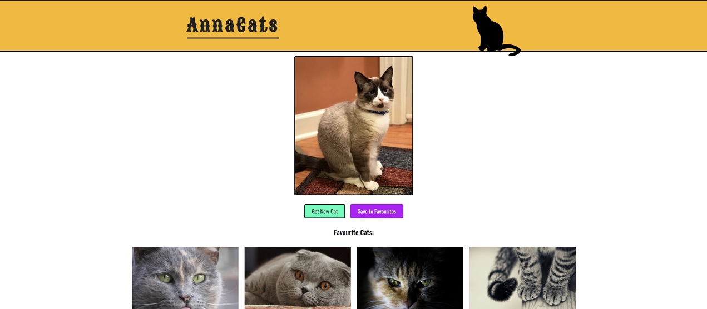

# AnnaCats

Practicing my CSS and JavaScript by building a cat gallery app thing for my friend Anna. Who is fond of cats, naturally.

Current version lives at: https://gordonwoodbine.github.io/annacats/

## To do:

- [x] Make responsive! Cos it ain't currently :(
- [ ] Fix button that looks different on iPhone for some reason
- [x] Add images to a favourites gallery
- [x] Style the gallery so it doesn't look shit
- [x] Save the gallery to local storage
- [x] Retrieve gallery from local storage (if one exists)
- [x] Have a way to delete images from gallery
- [x] Avoid adding duplicate images to gallery
- [ ] Create 'Already in Favourites!' alert
- [ ] Some form of gallery modal?
- [ ] Add 'back to top' navigation
- [x] Animate removing cats from gallery
